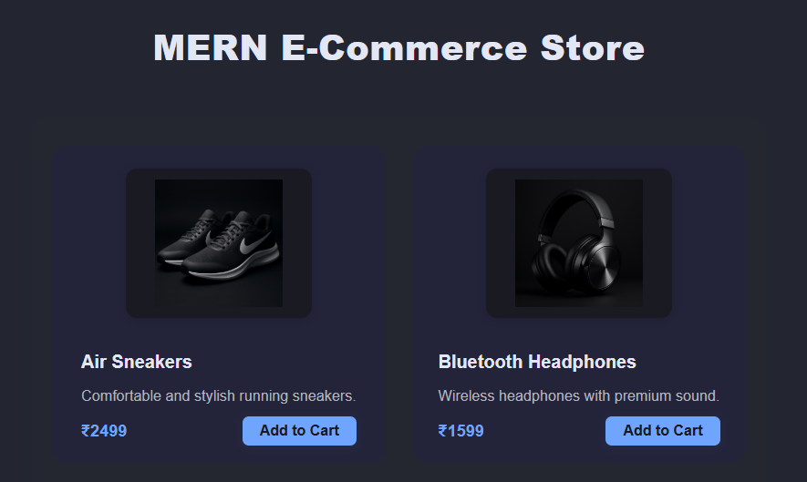
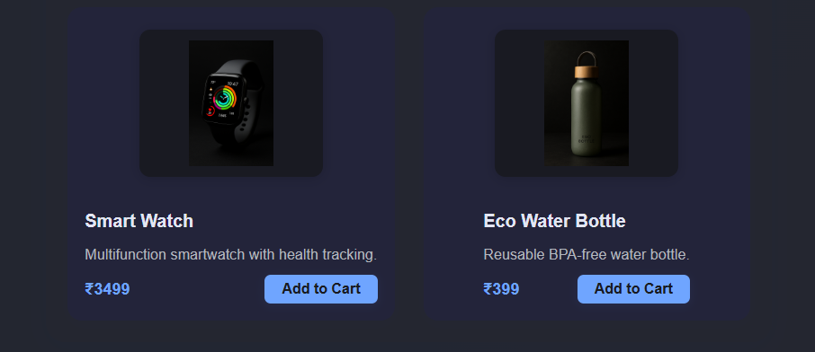
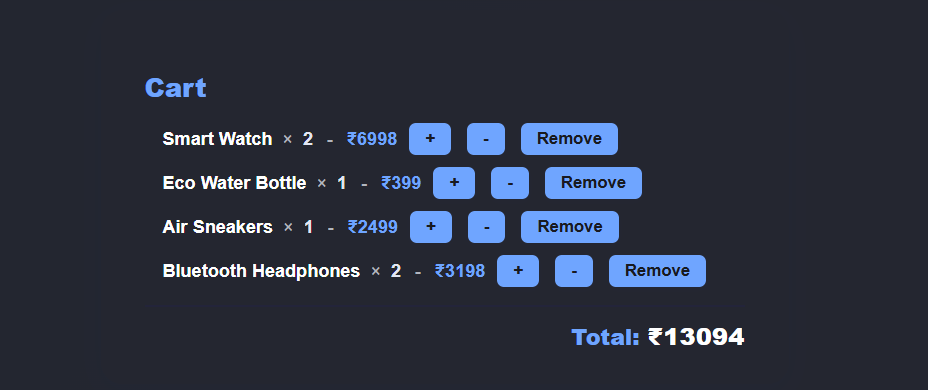

# E-Commerce Website Documentation

## Project Overview
A MERN stack e-commerce website with product listing, cart management, and real-time price updates.

## Features
- Product listing with images, names, prices, and descriptions
- Add to Cart, remove, and update quantity
- Dynamic total price calculation
- Responsive UI (custom CSS + Bootstrap)
- RESTful API backend

## Setup Instructions
### Backend
1. Navigate to `server` folder
2. Run `npm install`
3. Start MongoDB
4. Run `node seed.js` to seed products
5. Run `node index.js` to start server (http://localhost:5000)

### Frontend
1. Navigate to `client` folder
2. Run `npm install`
3. Run `npm start` (http://localhost:3000)

## API Endpoints
- `GET /items` - Get all products
- `POST /cart` - Add item to cart
- `DELETE /cart/:id` - Remove item from cart
- `GET /cart` - Get cart items
- `PUT /cart/:id` - Update cart item quantity

## Database
- **Items**: name, price, image, stock, description
- **Cart**: items [{ productId, quantity }]

## Testing
- Add/remove/update cart items
- Total price updates dynamically
- API endpoints tested with frontend

## Screenshots
- Dashboard: 
- Cart: 
- Results: 
